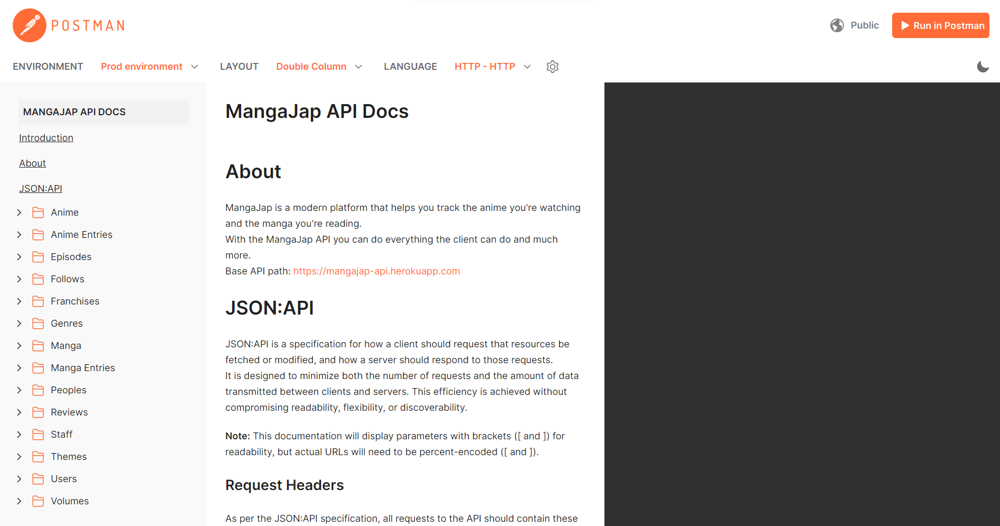

<h1 align="center">MangaJap: API</h1>

<p align="center">
  
  <br />
  MangaJap is an app that lets you organize yourself among all the manga and anime you love.
  <br />
  <a href="https://documenter.getpostman.com/view/10400618/2s9YeN3ora">
    <strong>View API Docs »</strong>
  </a>
  <br />
  <br />
  <a href="https://github.com/mangajap/mangajap-api/issues">Report Bug</a>
  ·
  <a href="https://github.com/mangajap/mangajap-api/issues">Request Feature</a>
</p>

<details>
  <summary>Table of Contents</summary>

- [About the project](#about-the-project)
  - [Features](#features)
  - [Built with](#built-with)
- [Getting started](#getting-started)
  - [Prerequisites](#prerequisites)
  - [Setup](#setup)
- [Development](#development)
- [Contributing](#contributing)
- [Author](#author)
- [License](#license)
</details>

## About the project

<p align="center">
  
</p>

MangaJap is a modern platform that helps you track the anime you're watching and the manga you're reading.

With the MangaJap API you can do everything the client can do and much more.

### Features

- 100% free and no ads!
- An enormous collection of manga and anime.

### Built with

- [Node.js](https://nodejs.org)
- [TypeScript](https://www.typescriptlang.org)
- [MongoDB](https://www.mongodb.com)
- [JSON:API](https://jsonapi.org)


## Getting started

### Prerequisites

- Install [Node.js](https://nodejs.org) which includes [Node Package Manager](https://www.npmjs.com/get-npm)

### Setup

1. Clone the project to your local machine

```bash
git clone https://github.com/mangajap/mangajap-api.git
```

2. Install the packages required

```bash
npm install
```

## Development

Run the application

```bash
npm run start:dev
```

## Contributing

Contributions are what make the open source community such an amazing place to be learn, inspire, and create. Any contributions you make are **greatly appreciated**.

1. Fork the project
2. Create your feature branch (`git checkout -b feature/amazing-feature`)
3. Commit your changes (`git commit -m 'feat: add some amazing feature'`)
4. Push to the branch (`git push origin feature/amazing-feature`)
5. Open a pull request

## Author

- [Lory-Stan TANASI](https://github.com/stantanasi)

## License

This project is licensed under the `Apache-2.0` License - see the [LICENSE](LICENSE) file for details

<p align="center">
  <br />
  © 2021 Lory-Stan TANASI. All rights reserved
</p>